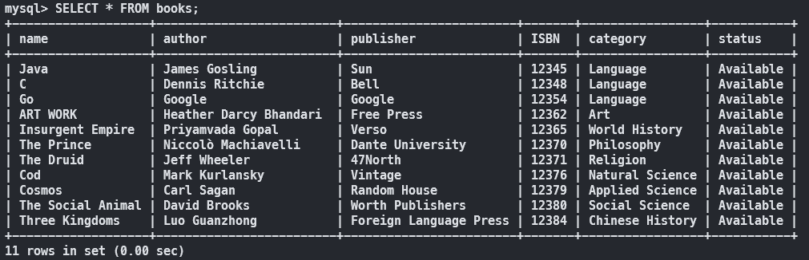

# Final_Project_Java_freshman_NCULibrary

## hackmd : https://hackmd.io/5nuexzjPTGSsaM8zgXN6OA

## mySQL 步驟

1. 下載 [Java Database Connetor (JDBC)](https://dev.mysql.com/downloads/connector/j/) (選擇 Platform Independent)
2. 解壓縮後將裡面的 `mysql-connector-java-8.0.23.jar` 在專案引入
3. 建立 mysql

```bash
mysql -u root -p
```

```sql
CREATE DATABASE java_final_project;
CREATE USER 'java'@'localhost' IDENTIFIED BY 'java';
GRANT ALL PRIVILEGES ON java_final_project.* TO 'java'@'localhost';
FLUSH PRIVILEGES;

USE java_final_project;
CREATE TABLE books (
    name VARCHAR(255) NOT NULL,
    author VARCHAR(255) NOT NULL,
    publisher VARCHAR(255) NOT NULL,
    ISBN INT NOT NULL,
    category VARCHAR(255) NOT NULL,
    status VARCHAR(255) NOT NULL
);
```


